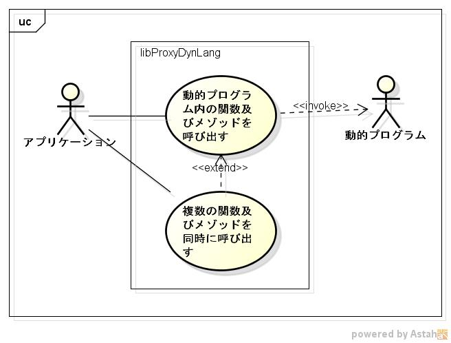
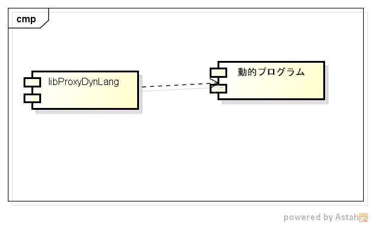
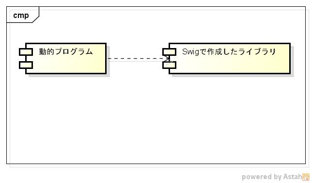

# libproxydynlang
c言語から動的言語(perl,python,ruby等)を呼び出すライブラリです。

## Description ##

詳細は、https://github.com/siranovel/libproxydynlang/wiki  
クラス図及びシーケンス図は、  
https://github.com/siranovel/libproxydynlang/wiki/design

## Demo ##

## VS. ##
* swig VS libproxydynlang  
  

## Requirement ##
VineLinux ver 6.5に付属しているライブラリに依存

## Usage ##

## install ##

    git clone https://github.com/siranovel/libproxydynlang.git  
    cd libproxydynlang  
    rpm -ivh <rpmファイル名>

## Contribution ##

## Licence ##

## Author ##
